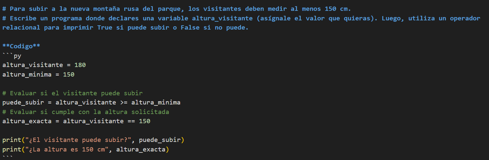
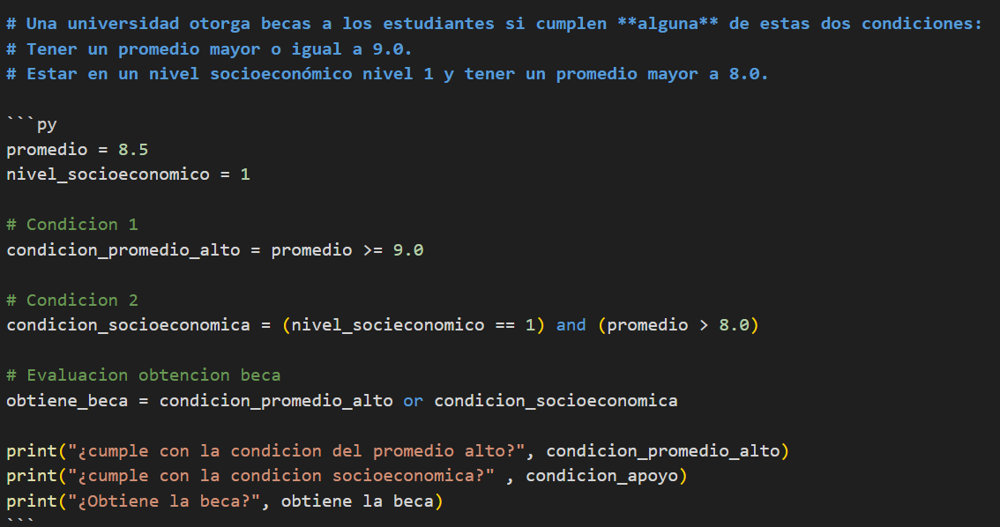

# Imagina que fuiste a cenar con 3 amigos (son 4 en total). La cuenta fue de $85. Además, quieren dejar un 15% de propina.
# Escribe un programa en Python que calcule:

**Codigo** 
```py
Personas = 4 
Cuenta = 85
Propina = 0.15 

# Total de la propina 
Total_propina = Cuenta * Propina

# Total a pagar 
Total_cuenta = Total_propina + Cuenta 

# Parte de cada persona: partes iguales 
Partes_iguales = Total_cuenta / Personas

print("Total de la propina es:" , Total_propina)
print("El total de la cuenta con la propina es:" , Total_cuenta)
print("Le corresponde a cada uno:" , Partes_iguales)
```

**Captura pantalla** 


# Para subir a la nueva montaña rusa del parque, los visitantes deben medir al menos 150 cm.
# Escribe un programa donde declares una variable altura_visitante (asígnale el valor que quieras). Luego, utiliza un operador relacional para imprimir True si puede subir o False si no puede.

**Codigo** 
```py
altura_visitante = 180 
altura_minima = 150 

# Evaluar si el visitante puede subir 
puede_subir = altura_visitante >= altura_minima
# Evaluar si cumple con la altura solicitada     
altura_exacta = altura_visitante == 150 

print("¿El visitante puede subir?", puede_subir)
print("¿La altura es 150 cm", altura_exacta)
```
**Captura de pantalla**


# Una universidad otorga becas a los estudiantes si cumplen **alguna** de estas dos condiciones:
# Tener un promedio mayor o igual a 9.0.
# Estar en un nivel socioeconómico nivel 1 y tener un promedio mayor a 8.0.

```py
promedio = 8.5
nivel_socioeconomico = 1

# Condicion 1 
condicion_promedio_alto = promedio >= 9.0 

# Condicion 2 
condicion_socioeconomica = (nivel_socieconomico == 1) and (promedio > 8.0)

# Evaluacion obtencion beca 
obtiene_beca = condicion_promedio_alto or condicion_socioeconomica 

print("¿cumple con la condicion del promedio alto?", condicion_promedio_alto)
print("¿cumple con la condicion socioeconomica?" , condicion_apoyo)
print("¿Obtiene la beca?", obtiene la beca)
```
**Captura de pantalla**

